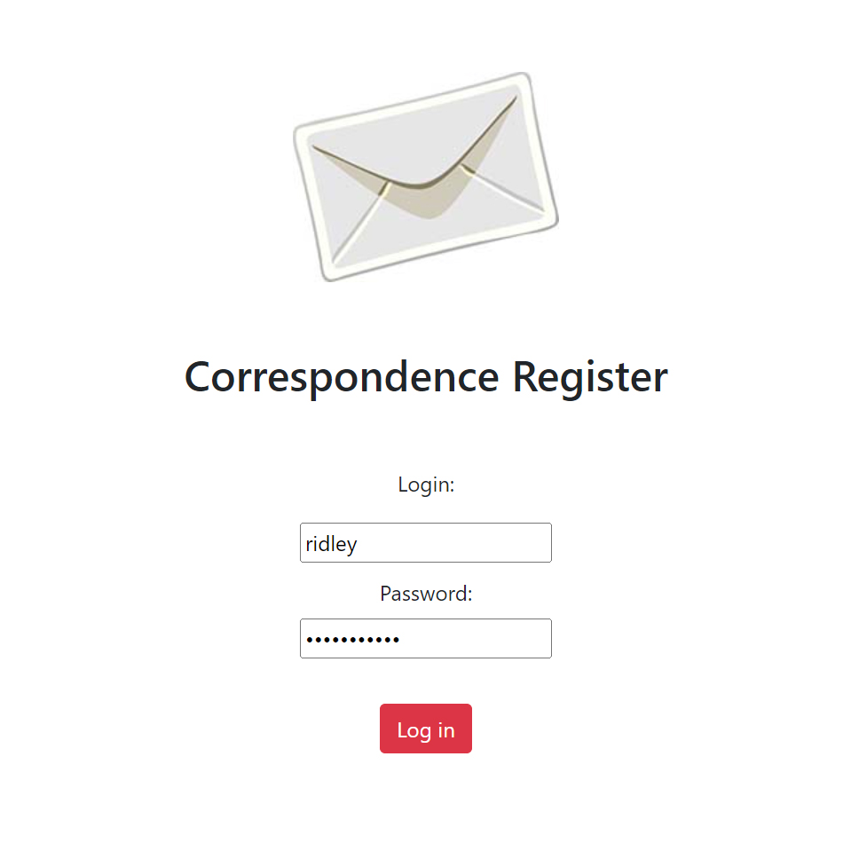
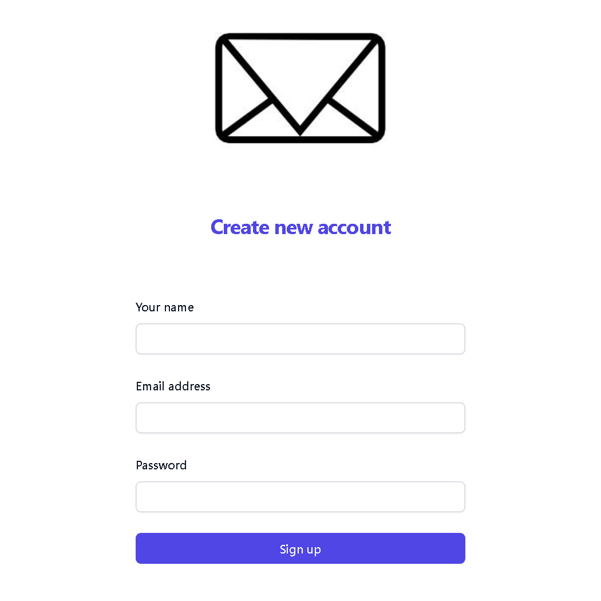
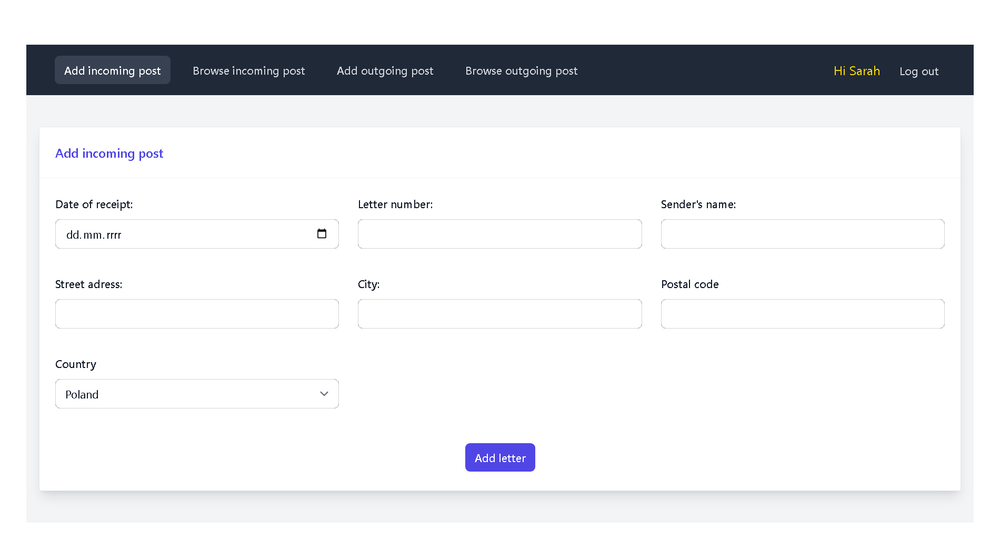
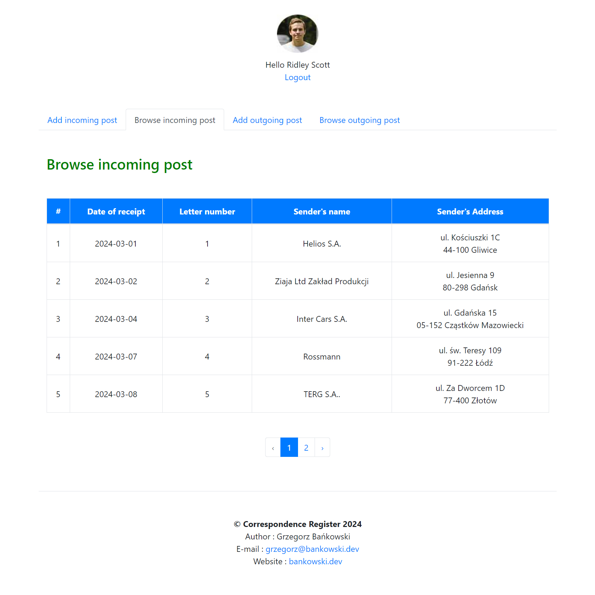
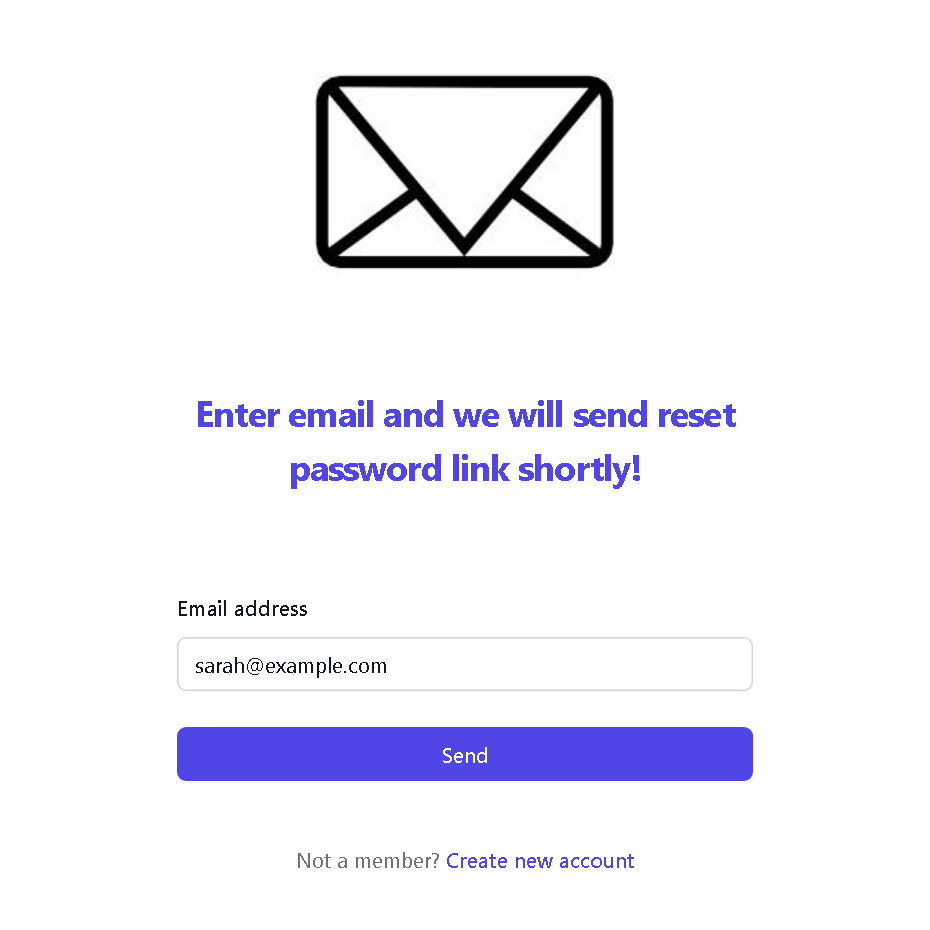

<p align="center">
    <a href="">
        
    </a>
</p>

# Correspondence Register

Correspondence Register is a microapplication I have written whose main task is to register incoming and outgoing correspondence for a company or other entity. In addition to adding letters, we can also view them in the form of summaries. Users are divided into basic users and administrators. Administrators can additionally add new users, edit and delete letters. The microapp was built from scratch with Laravel, one of the best and most popular PHP framework.

## Requirements

- PHP
- Composer
- MySQL
- Laravel

## Installation

1. Clone the repository, install the dependecies and setup your .env file.

```
git clone https://github.com/grzegorz-bankowski/correspondence-register.git
composer install
```

2. Create the database in MySQL 

```
CREATE DATABASE laravel;
```

3. Set email and password for users in /database/seeders/DatabaseSeeder.php

4. Run the initial migrations and seeders.

```
php artisan migrate --seed
```

5. Run application.

```
php artisan serve
```

## Live demo

- [Live demo](https://bankowski.dev/corresondence-register/)

## Feedback

If you have any feedback, please reach out to me at <grzegorz@bankowski.dev>

## Screenshots

<p align="center">
    
</p>
<p align="center">
    
</p>
<p align="center">
    
</p>
<p align="center">
    
</p>
<p align="center">
    
</p>
<p align="center">
    
</p>